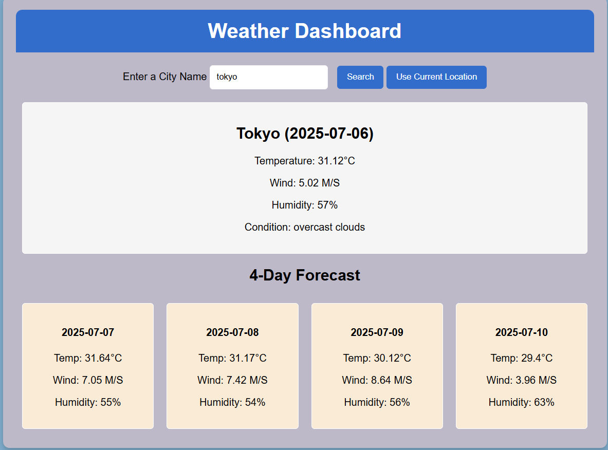

# 🌦️ Weather Dashboard

A responsive weather dashboard that provides real-time weather conditions and a 4-day forecast for any city using the **OpenWeatherMap API**.



> ⚙️ Built using HTML, CSS, and JavaScript – no frameworks!

---

## 🔍 Features

- 🌍 Search weather by city name
- 📍 Fetch weather using current location (via Geolocation API)
- 📅 Displays current weather and 4-day forecast
- 🌡️ Real-time temperature, humidity, wind speed, and condition
- 📱 Responsive UI with clean and simple design

---

## 🛠️ Tech Stack

- **HTML** – page structure
- **CSS** – layout and styling
- **JavaScript** – API calls and dynamic DOM manipulation
- **[OpenWeatherMap API](https://openweathermap.org/api)** – for weather data

---

## 🚀 Getting Started

### 1. Clone the Repository

```bash
git clone https://github.com/your-username/weather-dashboard.git
cd weather-dashboard
